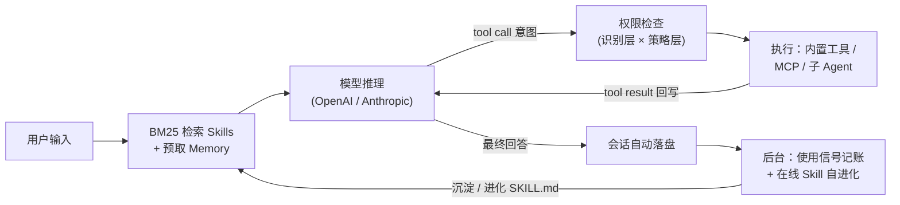
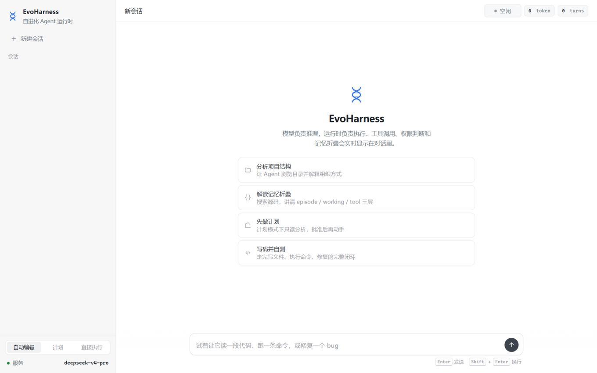
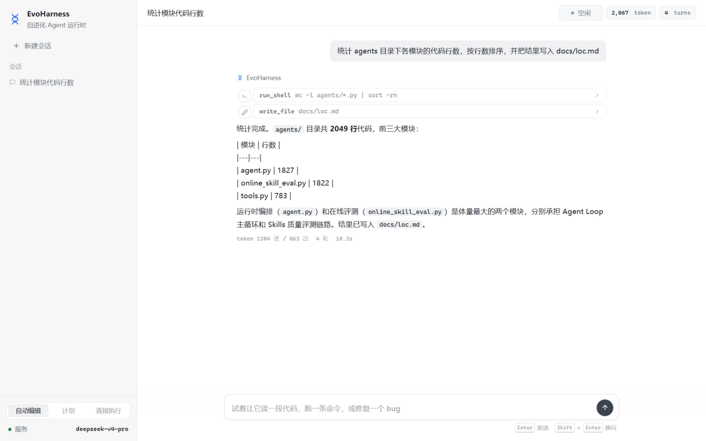

# EvoHarness

**🧭 模型提出意图 · ⚙️ 运行时决定执行 · 🧬 进化要有证据**

**自进化 Agent 运行时 · Self-Evolving Agent Runtime**

[](https://github.com/Nagrax/EvoHarness/actions/workflows/ci.yml)
[](https://www.python.org/)
[](https://fastapi.tiangolo.com/)
[](https://platform.openai.com/)
[](./LICENSE)

把大模型变成可靠的 coding agent，缺的从来不是推理能力，而是一个可控的运行时：上下文怎么管理、工具怎么放权、经验怎么沉淀、沉淀的质量怎么证明。EvoHarness 用 **8,000+ 行零重依赖的 Python** 回答这四个问题，同时提供 **CLI** 与 **Web** 双前端，支持 OpenAI / Anthropic 双协议。

---

## 📊 先看证据

665 题整体 benchmark：

| Benchmark | 题量 | EvoHarness | 对比基线 | 提升 |
| --- | --- | --- | --- | --- |
| GAIA（Pass@1） | 165 | **53.3** | HiRA 42.1 | **+11.2** |
| HLE | 500 | **20.2** | 13.6 | **+6.6** |
| GAIA 会话折叠消融 | 165 | 开折叠 **53.3** / 关折叠 44.7 | — | **+8.6 pp** |

折叠消融是核心研究结论之一：收益不是省 token，而是**长程任务中任务状态不丢**——agent 知道自己做到哪了、下一步干什么、哪些路走不通。

## 🧭 30 秒了解



Web 前端通过 SSE 实时展示推理文本、工具调用时间线、token 用量与运行轮次：

<p align="center">
  
</p>
<p align="center">
  
</p>

## 🧱 六个模块，一条演进链

整个运行时按依赖顺序长成六个模块：**先能跑 → 扛得住长任务 → 安全 → 记得住 → 会学习 → 证明学得对**。两块地基（①③）承载两条研究线（记忆线②→④、进化线⑤→⑥）。

| # | 模块 | 核心问题 | 代表机制 | 主要代码 |
| --- | --- | --- | --- | --- |
| ① | 透明 Agent Loop | 消息历史每个字节可控 | 双协议、流式 tool 参数拼装、每轮落盘 + `--resume` 读档修复 | `agent.py` |
| ② | 上下文压缩与会话折叠 | 长对话不丢任务状态 | 三层无损压缩优先、70% 硬阈值折叠为 episode/working/tool 三层结构化记忆 | `session_memory.py` |
| ③ | 工具权限与能力扩展 | 模型意图与环境动作隔离 | 识别层×策略层五档权限、Plan Mode、read+mtime 乐观锁、自研 MCP、三粒度子代理 | `tools.py` 等 |
| ④ | 长期记忆 | 跨会话记住会消失的信息 | markdown 记忆文件 + 两段式召回（程序扫清单、模型挑文件）+ 硬预算 | `memory.py` |
| ⑤ | Skills 在线自进化 | 从反馈沉淀可复用能力 | 下一轮反馈作证据、add/merge/revise/discard 四路决策、provenance 溯源 | `online_skill_evolution.py` |
| ⑥ | 离线评测与状态机 | 证明沉淀的质量 | replay 样本池、程序规则+LLM judge 双轨、五级状态机、champion 人工晋级 | `online_skill_eval.py` |

**闭环联动**（2026-09 新增）：状态机已接回运行时——评测物化状态表，检索按认证状态加权（healthy ×1.25 / watch ×0.75，孵化期不降权防饿死）；孵化期 Skill 注入打 provisional 标注并禁 fork；沉淀 14 天零检索自动归档；矛盾偏好走 revise 整体替换而非 merge 出自相矛盾的指令；`when_to_use` 触发变体经历史 query 检索重放验证（零模型成本）。

## 🚀 快速开始

### 1. 环境准备

- Python 3.11+，一个 OpenAI-compatible 或 Anthropic-compatible 模型接口

```bash
python3 -m venv .venv
source .venv/bin/activate        # Windows: .venv\Scripts\activate
pip install -r requirements.txt
```

### 2. 配置 `.env`（参考 `.env.example`）

协议由 base URL 自动判断（路径含 `/anthropic` 走 Anthropic 协议）：

```env
APIKEY=sk-your-api-key
API=https://your-host/v1
MODEL=deepseek-chat
```

> [!WARNING]
> `.env` 已被 `.gitignore` 忽略，切勿提交 API key。

### 3. 启动

**Web 前端**（推荐）：

```bash
python -m server.app             # 或 Windows 双击 start_web.bat
```

浏览器打开 <http://127.0.0.1:8800>，选择权限模式后即可下达任务。

**CLI 前端**：

```bash
python -m agents.main                         # 交互式 REPL
python -m agents.main "总结这个项目的核心模块"   # 一次性任务
python -m agents.main --plan "..."            # Plan Mode：先出计划再执行
python -m agents.main --resume                # 恢复最近会话
```

Skills 自进化默认开启（`EVOHARNESS_AUTO_SKILL_EVOLUTION=1`），后台写入受当前权限模式控制，推荐 `--accept-edits` 启动。

## ⚖️ 关键设计决策

| 决策 | 放弃了什么 | 换来什么 |
| --- | --- | --- |
| 自研 Agent Loop，不用 LangChain | 现成的消息封装 | 消息历史每个字节可控——折叠要替换整段历史、压缩要改写历史 tool result，黑盒里做不了 |
| 沉淀即上线，不先审后上线 | 发布前的质量门 | 无冷启动死锁（使用信号只能来自真实使用）；爆炸半径有界：检索只取前三、注入不强制、孵化期隔离 |
| 权限做在 runtime，不写进 prompt 劝模型 | prompt 约束的灵活性 | 代码强制的识别层（工具级+内容级）× 策略层（五档模式），模型不可信时底线仍在 |
| 纯文件 + BM25，不上向量库 | 语义检索的召回上限 | 零重依赖、人可直接改、git 可版本化；记忆/Skill 量级下关键词足够 |
| 评测只做 prompt 级重放 | agent 级行为评估 | 现任版本用历史原文、变体注入重生成，离线证指令质量；"会不会被调用"归线上 usage stats，两层各管一段 |
| champion 不自动覆盖线上 | 全自动进化 | 可审计、可回滚；评测层是观察哨不是执行器，换版本必须过人 |

## 🛡️ 已知边界

- **组合冲突只有静态检测**（规则互斥对 + 触发条件重叠 + 注入互相标注），两个 Skill 同时注入的组合重放评测尚未实现；
- **LLM judge 只当软规则**——输出不可信（截断、非纯 JSON 都踩过），程序规则才是硬底线，无模型时评测可降级运行；
- **检索权重 1.25 / 0.75 与孵化期 14 天为经验值**，未做网格消融；
- **champion 晋级纯人工复制**，半自动审批流程是下一步。

## 数据路径

| 数据 | 路径 |
|------|------|
| 项目级 Skills | `.evoharness/skills/<skill_name>/SKILL.md` |
| 用户级 Skills | `~/.evoharness/skills/<skill_name>/SKILL.md` |
| Skills 自进化审计 | `.evoharness/skill-evolution/` |
| 长期记忆 | `~/.evoharness/projects/<project_hash>/memory/` |
| 会话历史 | `~/.evoharness/sessions/` |
| 大工具结果 | `~/.evoharness/tool-results/` |
| Plan Mode 计划 | `~/.evoharness/plans/` |

## Docker

```bash
docker build -t evoharness .

docker run --rm -it \
  --env-file .env \
  -v "$PWD:/workspace" \
  -v evoharness-data:/root/.evoharness \
  evoharness
```

## 目录结构

```text
EvoHarness/
├── agents/                     # Agent Runtime 核心（约 8,000 行）
│   ├── main.py                 # CLI 入口与 REPL
│   ├── agent.py                # Agent Loop、模型调用、工具调度、上下文压缩
│   ├── tools.py                # 内置工具与权限系统
│   ├── memory.py               # 长期记忆
│   ├── skills.py               # Skills 加载、检索、执行
│   ├── skill_status.py         # 状态机与运行时的桥（检索加权/试用期）
│   ├── online_skill_evolution.py / skill_evolution.py
│   ├── online_skill_eval.py    # Skills 离线评测与状态机
│   ├── session_memory.py       # 会话记忆折叠
│   ├── mcp_client.py           # MCP stdio 客户端（337 行零依赖）
│   └── subagent.py / session.py / prompt.py / ui.py
├── server/                     # Web 后端（FastAPI + SSE 事件桥）
├── frontend/                   # Web 前端（零依赖单文件）
├── docs/screenshots/           # 界面截图
├── .evoharness/                # 项目级 Skills 与运行时产物
├── Dockerfile
└── requirements.txt
```

## License

[MIT](./LICENSE)
