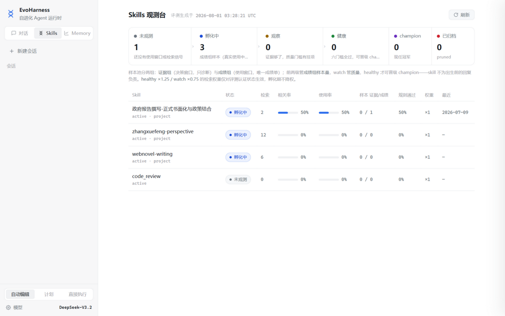
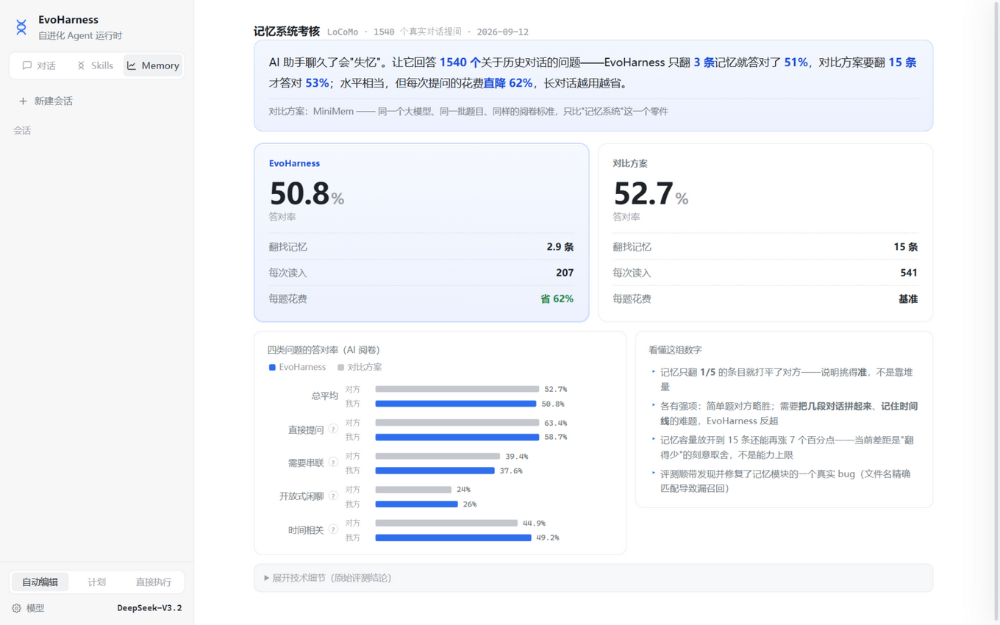
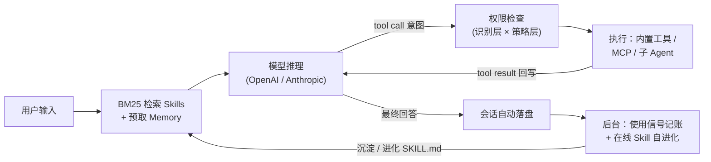

# EvoHarness

**模型提出意图 · 运行时决定执行 · 进化要有证据**

[](https://github.com/Nagrax/EvoHarness/actions/workflows/ci.yml)
[](https://m8ven.ai/mcp/nagrax/evoharness)
[](https://www.python.org/)
[](https://fastapi.tiangolo.com/)
[](https://platform.openai.com/)
[](./LICENSE)

把大模型变成可靠的 coding agent，缺的从来不是推理能力，而是一个可控的运行时：上下文怎么管理、工具怎么放权、经验怎么沉淀、沉淀的质量怎么证明。EvoHarness 用 **8,000+ 行零重依赖的 Python** 回答这四个问题，提供 **CLI / Web / 桌面** 三种使用形态，支持 OpenAI / Anthropic 双协议。

## 先看证据

三层证据链，从 benchmark 数字到可自动复跑的测试：

| 层 | 结果 | 对照 |
| --- | --- | --- |
| **Agent benchmark**（GAIA 165 题，Pass@1） | **51.5** | HiRA 42.1（+9.4）；自建可复现 runner（`eval/`） |
| **Agent benchmark**（HLE 500 题） | **20.2** | 基线 13.6（+6.6） |
| **会话折叠消融**（GAIA 165 题配对，McNemar） | 51.5 / 40.0（p=0.011） | 强制高频折叠消除全部上下文超限但降低完成率——定位当前实现"保活有效、保质为负"的结构性权衡，驱动修复方向 |
| **记忆系统**（LoCoMo 1540 问） | 1/5 检索量持平答对率，token **-62%** | MiniMem 向量检索基线；且评测直接定位并修复了 P0 召回丢失 bug（[详见下文](#-记忆系统评测与评测驱动的修复)） |
| **回归防线** | 单元测试 + CI | `tests/` 18 个测试：P0 召回四形态、SKILL.md 加载溯源、一键修复三类策略，push 即自动验证 |

## 三种使用形态，一套运行时

<p align="center">
  
</p>

Web 端三个视图：**对话**（SSE 实时展示推理文本、工具调用时间线、token/轮次）、**Skills**（五级状态机观测台）、**Memory**（记忆系统考核可视化）。

<p align="center">
  
</p>
<p align="center">
  
</p>
<p align="center">
  
</p>

- **CLI**：`python -m agents.main`——REPL、一次性任务、Plan Mode、`--resume` 会话恢复
- **Web**：`python -m server.app`——FastAPI + SSE 事件桥，`agents/` 核心零改动接入；支持访客自带 API key（BYOK，key 只存浏览器）
- **桌面**：双击 `desktop.pyw`——pywebview 原生窗口，关窗即退

会话历史自动落盘（`~/.evoharness/sessions/`），服务重启或换机后点击侧栏旧会话即可恢复完整上下文。

## 运行时链路



## 快速开始

```bash
python3 -m venv .venv && source .venv/bin/activate   # Windows: .venv\Scripts\activate
pip install -r requirements.txt
cp .env.example .env        # 填入 APIKEY / API / MODEL
python -m server.app        # Web：http://127.0.0.1:8800（改 .env 或代码自动热重载）
```

协议由 base URL 自动判断（路径含 `/anthropic` 走 Anthropic 协议）。换用其他模型或代理时，若上下文窗口与内置假设不符，可设 `EVOHARNESS_CONTEXT_WINDOW` 显式指定；未知模型默认按保守窗口处理（宁可早折叠，不可撞 413）。CLI 与更多选项：

```bash
python -m agents.main                         # 交互式 REPL
python -m agents.main --plan "..."            # Plan Mode：先出计划再执行
python -m agents.main --resume                # 恢复最近会话
```

> [!WARNING]
> `.env` 已被 `.gitignore` 忽略，切勿提交 API key。公开部署时建议不配环境变量，
> 使用前端 BYOK 模式让访客自带 key。

## 六个模块，一条演进链

按依赖顺序：**先能跑 → 扛得住长任务 → 安全 → 记得住 → 会学习 → 证明学得对**。两块地基（①③）承载两条研究线（记忆线②→④、进化线⑤→⑥）。

| # | 模块 | 核心问题 | 代表机制 | 主要代码 |
| --- | --- | --- | --- | --- |
| ① | 透明 Agent Loop | 消息历史每个字节可控 | 双协议、流式 tool 参数拼装、每轮落盘 + `--resume` 读档修复 | `agent.py` |
| ② | 上下文压缩与会话折叠 | 长对话不丢任务状态 | 三层无损压缩优先、70% 硬阈值折叠为 episode/working/tool 三层结构化记忆；折叠强制保留文件路径/已否定结果/下一步动作/用户约束四类硬状态，摘要附存档路径可 `read_file` 恢复 | `session_memory.py` + `agent.py` |
| ③ | 工具权限与能力扩展 | 模型意图与环境动作隔离 | 识别层×策略层五档权限、Plan Mode、read+mtime 乐观锁、自研 MCP（全工具带安全注解）、三粒度子代理 | `tools.py` 等 |
| ④ | 长期记忆 | 跨会话记住会消失的信息 | markdown 记忆文件 + 两段式召回（程序扫清单、模型挑文件）+ 硬预算 | `memory.py` |
| ⑤ | Skills 在线自进化 | 从反馈沉淀可复用能力 | 下一轮反馈作证据、add/merge/revise/discard 四路决策、provenance 溯源 | `online_skill_evolution.py` |
| ⑥ | 离线评测与状态机 | 证明沉淀的质量 | 证据组/成绩组双池（使用窗口=唯一成绩单）、程序规则+LLM judge 双轨、五级状态机、champion 人工晋级 | `online_skill_eval.py` |

**状态机已接回运行时**：评测物化状态表，检索按认证状态加权（healthy ×1.25 / watch ×0.75，孵化期不降权防饿死）；孵化期注入打 provisional 标注并禁 fork；沉淀 14 天零检索自动归档；矛盾偏好走 revise 整体替换；被检索即落一份使用窗口样本（relevant/used 是标注不是门槛，"被检索但没用"也记）——它是评测成绩组的唯一考卷。Web 端「Skills」观测台把这套判定变成可点击的数据：五级分布带、按"距晋级差几项"排序的列表、六门槛仪表（当前值 vs 门槛逐项对比）、结合 `last_reason` 的差距诊断。

## 关键设计决策

| 决策 | 放弃了什么 | 换来什么 |
| --- | --- | --- |
| 自研 Agent Loop，不用 LangChain | 现成的消息封装 | 消息历史每个字节可控——折叠要替换整段历史、压缩要改写历史 tool result，黑盒里做不了 |
| 沉淀即上线，不先审后上线 | 发布前的质量门 | 无冷启动死锁（使用信号只能来自真实使用）；爆炸半径有界：检索只取前三、注入不强制、孵化期隔离 |
| 样本池分证据组/成绩组，只考真实使用行为 | 全部历史样本统一打分的简单 | skill 不为出生前的回复负责——纠正型 skill 不被出生样本的必然挂科永久卡死；出生差距转为 before/after 有效性证据；手动导入 skill 因使用窗口首次可认证 |
| 权限做在 runtime，不写进 prompt 劝模型 | prompt 约束的灵活性 | 代码强制的识别层（工具级+内容级）× 策略层（五档模式），模型不可信时底线仍在 |
| 纯文件 + BM25，不上向量库 | 语义检索的召回上限 | 零重依赖、人可直接改、git 可版本化；记忆/Skill 量级下关键词足够（LoCoMo 上以 1/5 检索量打平向量基线） |
| 全部工具声明 MCP hints，双路径隔离 | 协议 schema 的简洁 | 宿主可在调用前给用户风险提示（OpenAI 工具目录强制要求）；hints 只在 MCP 暴露路径出现，Anthropic/OpenAI 调用路径自动剥除，互不污染 |
| 现任考真实使用行为，变体才重生成 | agent 级沙箱重放 | 现任的成绩单是 skill 在场时的真实回复（成绩组），变体注入指令重生成对比，另有"出生题重答"能力自检；离线不假装证明"会不会被调用"，那归线上 usage stats |
| champion 不自动覆盖线上 | 全自动进化 | 可审计、可回滚；评测层是观察哨不是执行器，换版本必须过人 |

## 🧠 记忆系统评测与评测驱动的修复

LoCoMo 数据集（10 段长对话、1540 个非对抗性问题），与 MiniMem 基线（LLM 抽取 + MiniLM 向量检索 top-15）对照：**同一大模型、题目、阅卷标准，只比记忆系统**。结果：1/5 检索条目（3 vs 15）持平答对率（judge 50.8% vs 52.7%），单题输入 token **-62%**，多跳与时间类反超。可视化见 Web 端「Memory」页，原始数据 `frontend/eval_results.json`。

评测不止于报告——直接定位并修复了两个生产问题：

| 级别 | 问题 | 修复 |
| --- | --- | --- |
| P0 | 召回匹配用精确文件名比较，而模型选择器会照抄 manifest 整行 / 带围栏 / 带路径前缀回指——四种形态三种**静默丢失全部召回** | `_normalize_selector_ref` 规范化双向包含匹配，四形态全 MATCH、跨文件正确拒绝（`tests/test_memory_recall.py` 覆盖） |
| P1 | 召回上限硬编码 `[:5]`，消融显示损失 judge 7.3pp | `MAX_MEMORY_RECALL` 环境变量化（默认 5），选择提示词同步参数化——上限与模型认知必须一致 |
| P1 | `run_shell` 在中文 Windows 下解析 GBK 编码的命令输出直接崩溃进程 | 显式 `encoding="utf-8", errors="replace"`，坏字符降级为占位符而非异常 |

## Agent 基准评测框架

`eval/run_benchmark.py`：GAIA / HLE 上的可复现评测——每题独立会话、线程级超时看门狗、断点续跑、`--fold-threshold` 折叠消融开关；GAIA 官方宽松口径判分（规范化 + 数值容差 + 列表序无关）带单元测试，HLE 按精确匹配/多选双轨。完整方法、逐题预测与结论（含折叠消融的同题配对 McNemar 分析）见 `eval/RESULTS.md`，一条命令复现。

## 已知边界

- **组合冲突只有静态检测**（规则互斥对 + 触发条件重叠 + 注入互相标注），组合重放评测尚未实现；
- **LLM judge 只当软规则**——输出不可信（截断、非纯 JSON 都踩过），程序规则是硬底线，无模型时评测可降级运行；
- **检索权重 1.25 / 0.75、孵化期 14 天、使用窗口每日上限 4 条均为经验值**，未做网格消融；成绩组依赖真实使用积累，新 skill 的认证天然有冷启动窗口（与"沉淀即上线"的宽进一致：先上线攒证据，后认证）；
- **champion 晋级纯人工复制**，半自动审批流程是下一步。

### SKILL.md 加载异常：从静默消失到一键修复

SKILL.md 写坏（GBK 编码、frontmatter 中文冒号、未闭合）过去会**静默消失**——skill 不加载、无任何日志。现在三层闭环：

1. **溯源落盘**：加载层用确定性代码（零模型）把 `load_failed`（解析抛异常）与 `load_warning`（不报错但行为静默变坏：元数据丢失、检索语料缺失）写入 `skill_load_errors.jsonl`，观测台红色警示面板实时展示；
2. **建议修复**：三类策略按语义风险分级——编码转码（零语义风险）→ 中文冒号替换并补空格 → 启发式补闭合线（歧义过大时拒绝出建议）。异常行点「建议修复」即见红删绿增 diff；
3. **一键应用**：`.bak` 备份（不覆盖已有备份）→ 重写（CRLF 归一）→ 重新解析验证，**失败自动回滚**；成功即刷新缓存进入检索语料。诊断开处方，人只做确认。

## 数据路径与部署

| 数据 | 路径 |
|------|------|
| 项目级 Skills / 自进化审计 | `.evoharness/skills/` · `.evoharness/skill-evolution/` |
| 用户级 Skills | `~/.evoharness/skills/` |
| 长期记忆 | `~/.evoharness/projects/<project_hash>/memory/` |
| 会话历史 | `~/.evoharness/sessions/` |

Docker 镜像默认即 Web 服务（`docker run -p 7860:7860 --env-file .env evoharness`，CLI 覆盖 entrypoint 即可）；在线体验需 Docker 类平台（HF Spaces / Render / Railway），纯静态托管只能展示截图、无法运行后端。

## 目录结构

```text
EvoHarness/
├── agents/                     # Agent Runtime 核心（约 8,000 行零重依赖）
│   ├── main.py                 # CLI 入口与 REPL
│   ├── agent.py                # Agent Loop、模型调用、工具调度、上下文压缩
│   ├── tools.py                # 内置工具与权限系统
│   ├── memory.py               # 长期记忆（两段式召回）
│   ├── skills.py / skill_status.py
│   ├── online_skill_evolution.py / skill_evolution.py
│   ├── online_skill_eval.py    # Skills 离线评测与五级状态机
│   ├── session_memory.py       # 会话记忆折叠
│   ├── mcp_client.py           # MCP stdio 客户端（零依赖）
│   └── subagent.py / session.py / prompt.py / ui.py
├── server/                     # Web 后端（FastAPI + SSE 事件桥 + BYOK）
├── frontend/                   # Web 前端（零依赖单文件：对话 / Skills / Memory）
├── tests/                      # 单元测试（CI 自动运行）
├── eval/                       # GAIA/HLE 基准评测框架（runner + 判分 + 逐题预测 + RESULTS.md）
├── desktop.pyw                 # 桌面启动器（pywebview）
├── docs/screenshots/           # 界面截图
└── Dockerfile                  # 默认 Web 服务，PORT 注入端口
```
